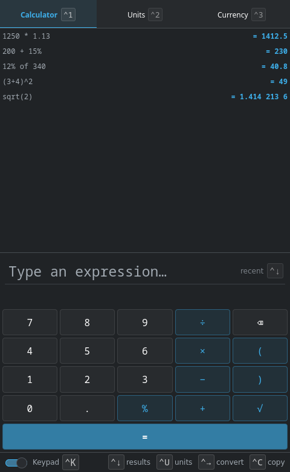
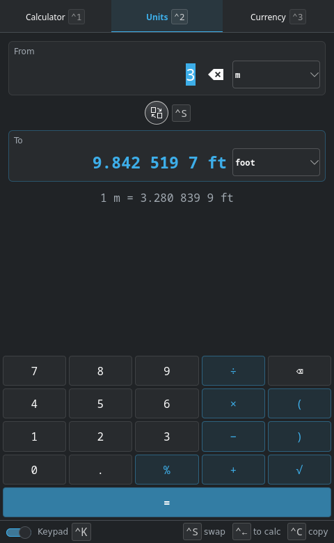
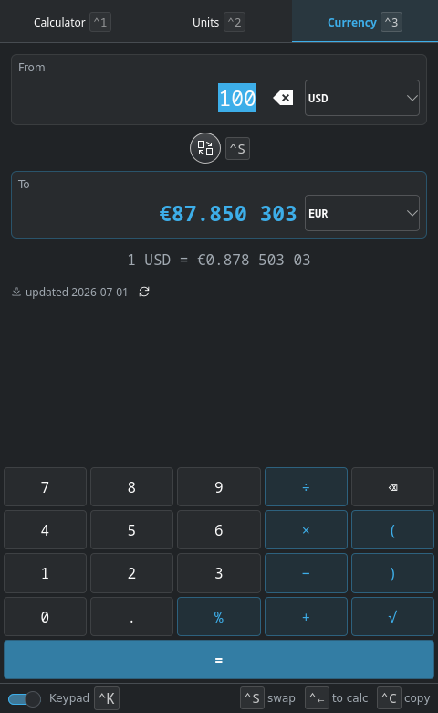

<div align="center">

# Kalk

**A modern, user-centric, powerful calculator for KDE Plasma & beyond.**

Type naturally, watch the answer update as you go, keep every result within reach,
and flow values straight into unit and currency conversions — all without leaving
the keyboard.

[](LICENSE)




</div>

---

## Why Kalk

Kalk has the calm of a phone calculator and the power of a desktop one. It's a thin,
native shell over the battle-tested [libqalculate](https://qalculate.github.io/)
engine, so the math is correct and the app stays fast and small.

<div align="center">

&nbsp;&nbsp;

</div>

## Features

- **Calculate as you type** — a live result preview updates with every keystroke.
- **Natural expressions** — `1,250 × 1.13`, `12% of 340`, `(3+4)^2`, `5 m/s to mph`.
- **Result register (tape)** — every result is kept, recall or re-edit any past entry.
- **Unit conversion** — 13 categories (length, area, volume, mass, temperature, data,
  speed, time, fuel economy, data rate, energy, frequency, angle), grouped and searchable.
- **Currency conversion** — daily exchange rates with graceful offline fallback.
- **Result flow** — send a result into a converter and the converted value back again.
- **Unit autocomplete** — type `ft`, `feet`, or `foot` and Kalk suggests the unit and
  the correct way to write it; `Ctrl+U` browses the whole list.
- **Keyboard-first** — every action has a visible key cue, an `Alt` access-key overlay,
  and a collapsible on-screen keypad that mirrors the keyboard.
- **Native theming** — follows your Breeze light/dark colour scheme automatically.

## Keyboard

| Key | Action |
|---|---|
| `Ctrl+1` / `Ctrl+2` / `Ctrl+3` | Calculator / Units / Currency |
| `Enter` / `=` | Evaluate and push to the tape |
| `Up` / `Down` | Recall history · `Ctrl+Down` opens the results dropdown |
| `Tab` | Accept the highlighted unit suggestion |
| `Ctrl+U` | Browse & insert a unit |
| `Ctrl+→` / `Ctrl+←` | Send a result to the converter / send it back |
| `Ctrl+S` · `Ctrl+K` · `Ctrl+C` | Swap from/to · toggle keypad · copy result |

## Build

Requires Qt 6, KDE Frameworks 6 (Kirigami, CoreAddons, Config, I18n), `libqalculate`,
Extra CMake Modules, and CMake. On most distros these are packaged.

```sh
cmake -B build -S . -DCMAKE_BUILD_TYPE=RelWithDebInfo
cmake --build build -j$(nproc)
./build/bin/kalk
```

### Flatpak

```sh
flatpak-builder --user --install --force-clean build-flatpak io.github.mpengellyca.kalk.flatpak.yaml
```

## Built with

Kalk was produced with the help of
[Claude Code](https://www.anthropic.com/claude-code),
[Agent Kate](https://github.com/mpengellyCA/agent-kate),
and [Claude Opus 4.8](https://www.anthropic.com/claude).

## License

Copyright © 2026 [Mike Pengelly](https://github.com/mpengellyCA).

Released under the **GNU Affero General Public License v3.0 or later** — see
[`LICENSE`](LICENSE). `libqalculate` is GPL-2.0-or-later and KDE Frameworks are LGPL.
