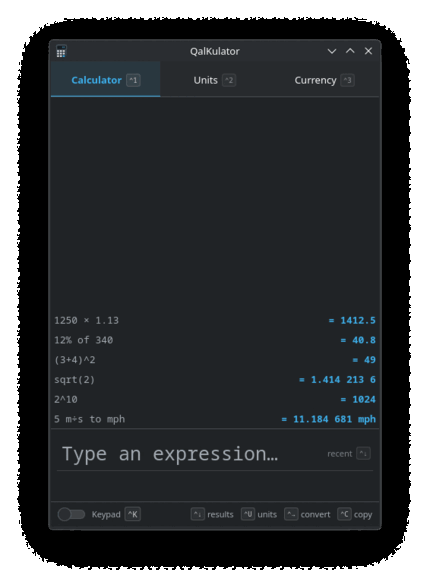
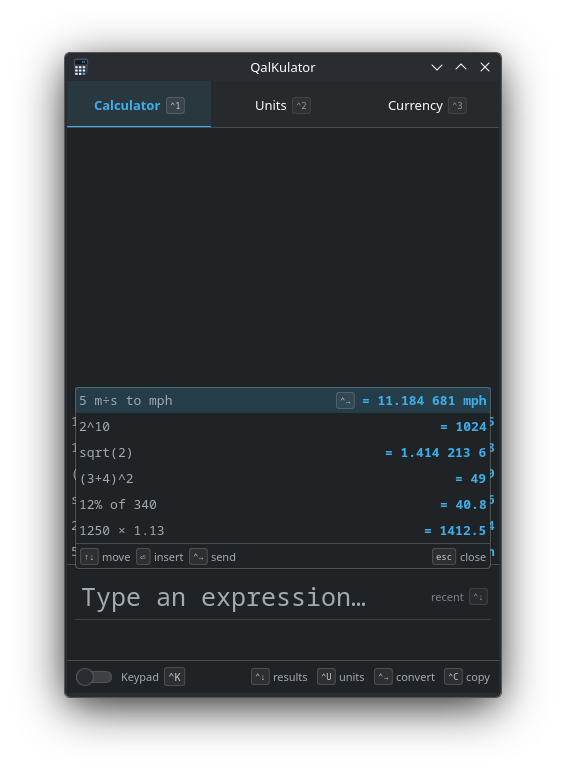
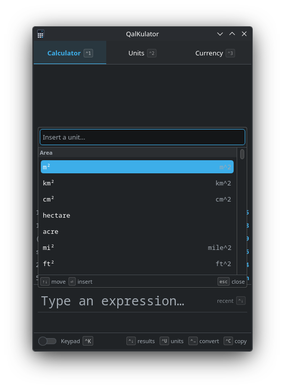
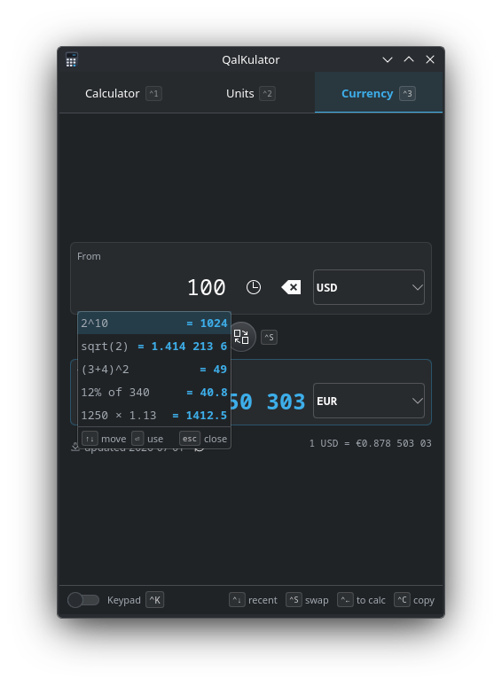
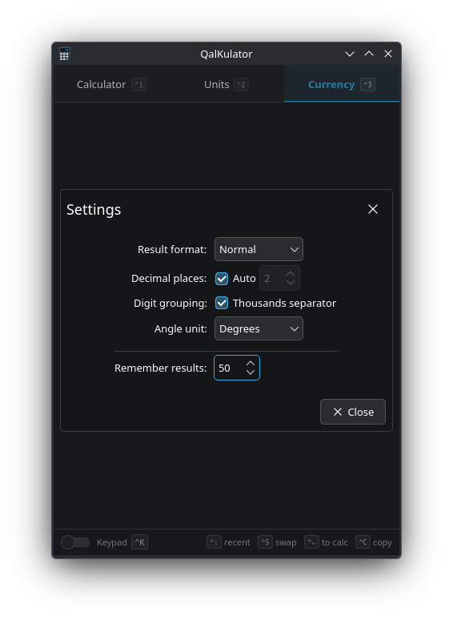

<div align="center">

# QalKulator Calculator

**A modern, user-centric, powerful calculator for KDE Plasma & beyond.**

> ⚠️ **Beta software.** QalKulator Calculator is under active development — expect rough edges and occasional breaking changes between releases.

Type naturally, watch the answer update as you go, keep every result within reach,
and flow values straight into unit and currency conversions — all without leaving
the keyboard.

[](LICENSE)




<sub>Calculate as you type · recall any result · convert units &amp; currency — all keyboard-first.</sub>

</div>

---

## Why QalKulator

QalKulator has the calm of a phone calculator and the power of a desktop one. It's a thin,
native shell over the battle-tested [libqalculate](https://qalculate.github.io/)
engine, so the math is correct and the app stays fast and small.

<div align="center">

&nbsp;&nbsp;

</div>

## Features

- **Calculate as you type** — a live result preview updates with every keystroke.
- **Natural expressions** — `1,250 × 1.13`, `12% of 340`, `(3+4)^2`, `5 m/s to mph`.
- **Result register (tape)** — every result is kept, recall or re-edit any past entry.
- **Unit conversion** — 13 categories (length, area, volume, mass, temperature, data,
  speed, time, fuel economy, data rate, energy, frequency, angle), grouped and searchable.
- **Currency conversion** — daily exchange rates with graceful offline fallback.
- **Result flow** — send a result into a converter and the converted value back again.
- **Unit autocomplete** — type `ft`, `feet`, or `foot` and QalKulator suggests the unit and
  the correct way to write it; `Ctrl+U` browses the whole list.
- **Keyboard-first** — every action carries a visible key cue, and a collapsible
  on-screen keypad mirrors the keyboard.
- **Linked windows** — open extra temporary calculator windows (`Ctrl+N`), each a
  separate thread of results with its own vivid accent colour; browse and pull in
  any window's results from the `Ctrl+↓` dropdown with `←/→`.
- **Native theming** — follows your Breeze light/dark colour scheme automatically.

## A closer look

<table>
  <tr>
    <td width="50%" valign="top" align="center">
      <br>
      <b>Recall anything</b><br>
      <sub><code>Ctrl+↓</code> reopens every past result — insert it, or send it straight to a converter.</sub>
    </td>
    <td width="50%" valign="top" align="center">
      <br>
      <b>Browse every unit</b><br>
      <sub><code>Ctrl+U</code> opens a searchable list grouped by category, with the right way to write each.</sub>
    </td>
  </tr>
  <tr>
    <td width="50%" valign="top" align="center">
      <br>
      <b>Flow results onward</b><br>
      <sub>Converters offer your recent, <i>compatible</i> results — reuse a number without retyping it.</sub>
    </td>
    <td width="50%" valign="top" align="center">
      <br>
      <b>Tune the details</b><br>
      <sub>Result format, precision, digit grouping and angle unit — sensible defaults, yours to change.</sub>
    </td>
  </tr>
</table>

## Keyboard

| Key | Action |
|---|---|
| `Ctrl+1` / `Ctrl+2` / `Ctrl+3` | Calculator / Units / Currency |
| `Enter` / `=` | Evaluate and push to the tape |
| `Up` / `Down` | Recall history · `Ctrl+Down` opens the results dropdown |
| `Tab` | Accept the highlighted unit suggestion |
| `Ctrl+U` | Browse & insert a unit |
| `Ctrl+→` / `Ctrl+←` | Send a result to the fitting converter — units→Units, currency→Currency, a plain number→Units (press `Ctrl+→` again for Currency) — or send the converted value back |
| `Ctrl+S` · `Ctrl+K` · `Ctrl+C` | Swap from/to · toggle keypad · copy result |
| `Ctrl+N` / `Ctrl+W` | New temporary window / close the current window |
| `←` / `→` (in the results dropdown) | Browse other windows' histories |
| `Ctrl+,` | Open settings |

## Build

Requires Qt 6, KDE Frameworks 6 (Kirigami, CoreAddons, Config, I18n), `libqalculate`,
Extra CMake Modules, and CMake. On most distros these are packaged.

```sh
cmake -B build -S . -DCMAKE_BUILD_TYPE=RelWithDebInfo
cmake --build build -j$(nproc)
./build/bin/qalkulator
```

### Flatpak

```sh
flatpak-builder --user --install --force-clean build-flatpak io.github.mpengellyca.qalkulator.flatpak.yaml
```

## Contributing

QalKulator Calculator is **beta** and contributions are welcome — from **people** and from
**human-guided AI agents** working under a person's direction and review.

Please **do not** open **automated or unguided agent** pull requests, issues, or comments
(unattended bots, mass-generated reports, or agents acting without a responsible human).
Such contributions will be closed. A real person must stand behind every submission,
understand it, and be able to discuss it.

See [`CONTRIBUTING.md`](CONTRIBUTING.md) for details.

## Built with

QalKulator was produced with the help of
[Claude Code](https://www.anthropic.com/claude-code),
[Agent Kate](https://github.com/mpengellyCA/agent-kate),
and [Claude Opus 4.8](https://www.anthropic.com/claude).

## License

Copyright © 2026 [Mike Pengelly](https://github.com/mpengellyCA).

Released under the **GNU Affero General Public License v3.0 or later** — see
[`LICENSE`](LICENSE). `libqalculate` is GPL-2.0-or-later and KDE Frameworks are LGPL.
